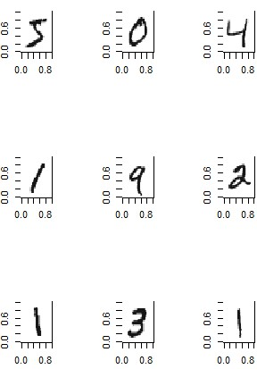

# How to build a smart application

//anmerkung: schreibe für einen Freund, hilf dem Leser sein problem zu lösen

## Abstract
//todo: motiviere Leser das dokument zu lesen und zeige wie viel arbeit wir investiert haben

This document has been created as a collaborative effort by Sonja Gassner, Veronica Pohl and Matthias Leopold for internal use at the Zuehlke Engineering AG. It will be most interesting for those who are about to start a project, where the objective involves building a business application around a machine learning task.

We will try to get an insight of the possible challenges and problems, when building a *smart application* for production that solves a complex machine learning problem, involving both software engineers and data analysts. Moreover, we will  focus on the collaboration between those two groups in particular and try to point out the communication difficulties.

We define a *smart application* as an application which includes the following tasks (amongst others):
* Fetching data from different sources
* Preprocessing the data
* Training a machine learning model
* Building a stable business application around the model and use it for predictions
* Being able to easily replace the prediction model with new model versions

In the following we want to demonstrate a full process cycle, helping you to prepare for your own project.

## Transfer a machine learning model between technologies
As you might have experienced, the technology stack used by data analysts will most certainly not match with what is used for building big applications in a business environment. The data analyst might use a technology such as R or Python to explore data, extract features and train a machine learning algorithm, but the software engineer wants to build his enterprise application with Java EE, Spring or other technologies. Therefore one of the big challenges can be to enable the enterprise application to use the trained machine learning model for predictions.

For this matter we came up with two different solution approaches:
* **Model as a Service**: The whole machine learning model is supposed to be transferred from Python/R to Java, to directly execute predictions in Java
* **Inference as a Service**: The machine learning model is supposed to be deployed from Python/R and an inference service is supposed to be made available as a RESTful API

Since todays state-of-the-art machine learning is mostly done in either Python or R, we will describe the possibilities for those two technologies.
### Use a model that was trained in R 

[R](http://www.r-project.org/) is known as a language and environment for statistical computing and graphics. It is a free open source software and provides linear and nonlinear modeling, classical statistical tests, time-series analysis, classification and clustering. One of R's strengths is the ease with which well-designed publication-quality plots can be produced, including mathematical symbols and formulae. At first, R was primarily used in academics and research, but lately the enterprise world is discovering R as well. This makes R one of the fastest growing statistical languages in the corporate world. Besides, R has an extensive documentation and an active online community support. All in all it is the perfect environment to get started in statistical computing and which is used by many data scientists around the world.

For a detailed introduction the manual ["An Introduction to R"](https://cran.r-project.org/doc/manuals/r-release/R-intro.pdf) is recommended.

We recommend to install the latest free open source [R software](https://cran.r-project.org/) and integrate a development environment (IDE) for R like [RStudio](https://www.rstudio.com/).

#### Inference as a Service

By understanding inference as a service as deploying the machine learning model from R and making an inference service available as a REST API, we take first the MNIST data set of handwritten digits and train different models in R by using random forest. 



There are three models involved in the prediction:
* **empty model**: This model does not uses the input data and predicts always the number 0.
* **small model**: This model does use the input data. It was trained with random forest by using 50 trees and 60000 observations.
* **large model**: This model does use the input data. It was trained with random forest by using 500 trees and 60000 observations.

If you are search for tools which deploys R code as REST API in the world wide web there are several tools. Every tool promise to be the best with only a few steps. We choose the following:

* [Plumber](https://github.com/IndustrialML/R_RESTApi/tree/master/plumber)
* [OpenCPU](https://github.com/IndustrialML/R_RESTApi/tree/master/openCPU)
* //todo Microsoft Machine Learning Server

##### Plumber
[Plumber](https://cran.r-project.org/web/packages/plumber/plumber.pdf) is an R package with is free available. Plumber is hosted on CRAN, so you can download and install the latest stable version and all of its dependencies by running in R:

```{r}
install.packages("plumber")
library(plumber)
```
> ### :information_source: Package plumber (version 0.4.2)
> The package plumber (version 0.4.2) depends on R (>= 3.0.0) and imports R6 (>= 2.0.0), stringi (>= 0.3.0), jsonlite (>= 0.9.16), httpuv (>= 1.2.3) and crayon (1.3.4).

For using plumber as REST API service, one have to use the following structure:
1. There should be one R script which deploys some functions with plumber. We call it *deploy_rf_pkg.R*. It has to look like this

* for GET 
```{r}
#* @get /predict
function.get<- function(){
    return( "Hello, Test" )
}
```
* for POST 
```{r}
#* @post /predictsmallpkg
function.post <- function(req){
    json <- req$postBody # access the json directly
    list <- fromJSON(json)
    result <- make_something(list)
    return(as.numeric(as.character(result))) #returns a numeric value
}
```

2. There should be one R script which install the needed R packages and run the script *deploy_rf_pkg.R* on the server. We call this script *install_and_runport.R*

```{r}
# load packages
library(plumber)
library(...)

r <- plumb("deploy_rf_pkg.R")
r$run(port=8080, host='0.0.0.0')
```
To use the R script in a Docker container one have to state `host='0.0.0.0'`.

For more information and a full example, we refer to [plumber in R_RESTApi](https://github.com/IndustrialML/R_RESTApi/tree/master/plumber) and its docs.

If you might guess plumber is not the simplest way to make a prediction available. It uses only R code. On the one hand, if one want to make the input and output available as a JSON format, one have to implement this by hand. On the other hand, this is a great way for searching problems or other connecting issues. 

##### OpenCPU

[OpenCPU](https://www.opencpu.org/) is an open source system for embedded scientific computing and reproducible research which was developed by Jeroen Ooms who is a postdoc at University of California Berkeley. It uses R code only in R packages. Therefore, if not common R packages are used, own R packages have to be created. The procedure for this have we described in [*Create_Rpackage.md*](https://github.com/IndustrialML/R_RESTApi/blob/master/docs/Create_RPackage.md).

There are two ways to install OpenCPU. First is to have an Ubuntu server and install it directly or, second, you uses Docker and install the Ubuntu environment and the OpenCPU in an container.

We choose the second way, because it is available on every system fast and do not need any complicated installation e.g. on Windows. If you have all R code available in R packages, it needs no more specific code but you have to install Docker. That's it! So easy is OpenCPU.

O.k. - wait, this is one aspect. We do not forget making requests. Making request is in return more complicated than other tools, but feasible. Other than normally the status code for OpenCPU is **"201 Created"** which means the request has been fulfilled and has resulted in one or more new resources being created. By setting the output equal to a JSON format one can avoid this circumstances. It looks like follows:

* Local:
http://localhost:port_number/ocpu/library/package_name/R/package_function/json

Our full example can be seen in [here](https://github.com/IndustrialML/R_RESTApi/tree/master/openCPU).

##### //todo Microsoft Machine Learning Server


#### Model as a Service
We show now how we transferred one whole machine learning (ML) model from R to Java, to execute predictions directly in Java. We choose as ML model the "old-school" Random Forest, that solve the classification problem for the [MNIST](https://en.wikipedia.org/wiki/MNIST_database) data set. In the MNIST data set one image has 28*28 = 784 pixels with values between 0 and 255. The set is organized row-wise. 

We start training our model in R. It is very important that the trained model should be generated with input data using the formula interface e.g. 
s
```
randomForest( Y ~ . , d.train) 
``` 

instead of 

```{r}
randomForest(x = d.train[, -785], y = d.train[, 785])` ,
```

where ` d.train[, -785]` is our training set and `d.train[, 785]` are the labels for each pixel of this training set. This is one bug which is still in the R package "pmml" (version 1.5.2). Hopefully, it will be solved in the future.

By saving this trained model as a *.pmml file* we have already done the wanted. Okay, it is not so simple but with this following code which convert the model to pmml and save it as *"model.pmml"* most of the work is done:

```{r}
# load xml and pmml library
library(XML)
library(pmml)

# convert model to pmml
model.pmml <- pmml(model, name = "MNIST Random Forest", data = model)

# save to file "model.pmml"
saveXML(model.pmml, file = "/path_where_it_should_be_saved/model.pmml"))
```
Now you can decide in which programming language you want to run your prediction. We choose Java :smile:

Therefore, you have to run the [MNISTClassifier](https://github.com/IndustrialML/R2Java/blob/master/MLJava/src/main/java/RandomForest/MNISTClassifier.java) class. For the full documentation on the `MNISTClassifier` please refer to the [Python2Java](https://github.com/IndustrialML/Python2Java/tree/master/MaschineLearning4J/src/main/java/RandomForest) repository. For now we will try to make you familiar with its usage. We are using the `mvn exec:java` command to run the program. For `Maven` to know which method to run, we need to specify a `mainClass` and pass this argument: `-Dexec.mainClass="RandomForest.MNISTClassifier"`
You can and will need to pass additional program parameters to the class by adding the `-Dexec.args="..."` argument to the `mvn exec:java` command. You can pass in following arguments to the program:
```bash
usage: MNISTClassifier
 -b,--benchmark-test   pass, if you want to run and print the benchmark
                       test
 -c,--compare          pass, if you want the results from Python and Java
                       to be compared for sameness. This action cannot be
                       performed for the R-technology
 -h,--help             print this info message again
 -n,--n-trees <arg>    number of decision trees that were used to create
                       the PMML. Please check for which number of trees,
                       you have a valid PMML file on your system. Default
                       value will be 50
 -p,--picture <arg>    name of the picture, to predict its displayed
                       digit. <Arg> can either be a full path or a file in
                       the Data/Own_dat directory of this project. Default
                       value will be R2Java/MLJava/MNIST-7.png
 -r,--use-R            pass, if the pmml you want to load is from a model,
                       created with R
```
If you are sticking to the following rules, you have made it!

* *Always*! use the `-r` parameter
* Never use the `-c` parameter!
* Make sure to pass in a valid value to the `-n` parameter. Do not pass it in if you want to use the default of 50 trees
* If you use the `-p` parameter, you need to pass in an absolute path to a .png file

For more details we refer to [R2Java](https://github.com/IndustrialML/R2Java).

##### (Dis)Advantages

As you might guess, transferring a ML model needs to save the whole model which may require a lot of memory space. It takes some time to save it - believe us. Furthermore, one can get in trouble to push it to github or send it, e.g. our model is over 786000 KB large. Further, you need a shared folder or any other service to transfer the model, if you don't want to use it yourself locally. It is no REST API and hence not available everywhere. But this means you have control over who get it and use it. Another advantage is that it is very easy to convert the model to pmml and the *.pmml file* can not only be used by Python. Thus, it is easily transferable to other programming languages.

### Use a model that was trained in Python
Python is an interpreted, high-level, multipurpose programming language with a simple and easy to learn syntax, which is one of the contributing factors to Pythons recent and continuous success. Python has a solid claim on being the fastest-growing major programming language. You can look at the [Stack Overflow Trends](https://insights.stackoverflow.com/trends?tags=python%2Cjava%2Cr%2Cc%23%2Cjavascript%2Cscala&utm_source=so-owned&utm_medium=blog&utm_campaign=gen-blog&utm_content=blog-link&utm_term=incredible-growth-python) and see that Python has been growing rapidly in the last few years:

> 

This might correlate with the strong upwards trend of Machine Learning and Deep Learning as a bunch of strongly supported and mighty packages are available for Python, such as `SciPy`, `Scikit-learn`, `Theano` and of corse `Tensorflow`. Beyond that, Python has always been a strong programming language for exploring data and doing statistical analysis, as Python code is very quick to write and modify, and provides strong packages for scientific computing, such as `NumPy`.

When querying [indeed.com](https://www.indeed.com/jobtrends/q-python-and-(%22machine-learning%22-or-%22data-science%22)-q-R-and-(%22machine-learning%22-or-%22data-science%22)-q-Java-and-(%22machine-learning%22-or-%22data-science%22)-q-scala-and-(%22machine-learning%22-or-%22data-science%22).html) for jobs in machine learning / data science, we can see that Python currently is the language with the highest demand:

> 

So, now that we know that Python is great and used all over the place, lets dive in to how we can use our machine learning algorithms, that we trained with Python, for production in Java.
I have documented my work in more detail [here](https://github.com/IndustrialML/Python2Java) and if you are interested you are more than welcome to read the whole thing. In the following I will link references whenever appropriate. 

#### Saving and exporting a model
Before we can start using a model, in whatever way, we will have to train one and somehow export it, so that we can use it at a later point in time. As this will be different for each Python framework, I will supply you with a few different options. The main difference between models is going to be, whether they implement a deep learning or a "usual" machine learning algorithm. For the sake of demonstration, I trained and exported a Neural Network and a Random Forest, that solve the classification problem for the [MNIST](https://en.wikipedia.org/wiki/MNIST_database) dataset, full examples can be found [here](https://github.com/IndustrialML/Python2Java/tree/master/Maschine%20Learning).
##### Neural Network
As `Tensorflow` emerges as by far the most popular deep learning framework, I will join the majority. The easiest way to save a trained model in `tensorflow` is to use the `tensorflow.train.Saver()` class, provided directly from `tensorflow`. An example workflow is shown [here](https://github.com/IndustrialML/Python2Java/tree/master/Maschine%20Learning/NeuralNetwork/Tensorflow/MNISTClassifier#saver), however as this method does not save the model platform independent, but rather only to re-import it into Python later, this does not satisfy our needs. Another option would be to make use of the [JPMML-Tensorflow](https://github.com/jpmml/jpmml-tensorflow) project, to parse the trained model to the [PMML](http://dmg.org/pmml/v4-3/GeneralStructure.html) standard format, and use the [JPMMLEvaluator](https://github.com/jpmml/jpmml-evaluator) to read out the PMML file and recreate the model in Java. This option would be somewhat platform independent, but heavily relies on the third party `JPMML` project and the import would be restricted to Java only.

Hence, I am gladly proposing a third method, which limits itself to only use the `Tensorflow` framework for the transfer and offers greater platform independence, even though i will only present you with a Java example. The point of matter here is, that `Tensorflow` officially supports different API’s for different languages. According to the official [documentation](https://www.tensorflow.org/api_docs/), you can savely use Java, C++ and Go, aswell as some other languages with weaker support, like Scala or Ruby. This method will use the `tensorflow.saved_model` Python serialisation class, for which an official introduction can be found [here](https://www.tensorflow.org/programmers_guide/saved_model#apis_to_build_and_load_a_savedmodel). 

The export of a neural network, built with Tensorflow, can be easily accomplished with:
```python
    Session session = tf.Session()
    #build and train model...
    export_dir = "./export"
    builder = tf.saved_model.builder.SavedModelBuilder(export_dir)
    builder.add_meta_graph_and_variables(session, [tf.saved_model.tag_constants.SERVING])
    builder.save()
```
The last line of codes, executes the export and creates files, representing the neural network, inside the "export" directory. To be more specific, it creates the architecture describing "saved_model.pb" file and another subdirectory, containing all information about the weights and biases.

Now, we could conclude this section without further ado, but often it is advisable to add a `Signature` to the `SavedModel`, describing the set of inputs and outputs of a model. This step is important, because we will need to know the exact names of the input and output structures, in order to being able to use the model for prediction in Java, as we will show later. We can add a signature by modifying the code above:

```python
    signature = tf.saved_model.signature_def_utils.build_signature_def(
        inputs={'input': tf.saved_model.utils.build_tensor_info(x),
                'dropout': tf.saved_model.utils.build_tensor_info(dKeep)},
        outputs={'output': tf.saved_model.utils.build_tensor_info(y)},
    )
    signatureMap = { tf.saved_model.signature_constants.DEFAULT_SERVING_SIGNATURE_DEF_KEY: signature }

    builder = tf.saved_model.builder.SavedModelBuilder(export_dir)
    builder.add_meta_graph_and_variables(session, 
        [tf.saved_model.tag_constants.SERVING], 
        signature_def_map=signatureMap)
    builder.save()
```
Note, that `x` is the `tf.placeholder` for the input layer, `dKeep` is the `tf.placeholder` for the dropout rate, and `y` is the output layer of the neural network.


This signature can then be inspected, using the [SavedModel CLI](https://www.tensorflow.org/programmers_guide/saved_model#cli_to_inspect_and_execute_savedmodel). For our example neural net, the output can look as following: 

> 

For more information and a full work through, please refer to the Python2Java repository [here](https://github.com/IndustrialML/Python2Java/tree/master/Maschine%20Learning/NeuralNetwork/Tensorflow/MNISTClassifier).

As mentioned earlier, performing the export is going to be dependent on which framework you are using to train your model. This introduction covered only plain `Tensorflow`, if you want to, or have already, build a neural network with  `Tensorflow.Estimator` or `Keras` with `Tensorflow` backend, I have covered these in the Python2Java repository aswell. Please follow the link to the documentation for [Estimator](https://github.com/IndustrialML/Python2Java/tree/master/Maschine%20Learning/NeuralNetwork/Estimator/MNISTClassifier) or [Keras](https://github.com/IndustrialML/Python2Java/tree/master/Maschine%20Learning/NeuralNetwork/Keras). The workflow to achive the export will differ a bit, but in the end the trained neural network will be saved as a `SavedModel` aswell.

##### Random Forest
Just like `Tensorflow` seems to be the top dog for building neural networks in Python, `scikit-learn` (or short: `sklearn`)  looks to be its counterpart for basically everything else in Python's machine learning. Therefore, I will now show you how to export an `sklearn.ensemble.RandomForestClassifier`. The workflow will be mostly the same for every other `sklearn` classifier.

If you are only looking to save your model, to re-import it into Python at a later point in time, for example to use it to provide a simple RESTfull API, this is a very easy task. Most of the `sklearn` classifiers are "pickleable"(if that is a word), which means that you can simply save your whole classifier as a ".pkl" file, using Pythons build in serializing and de-serializing module `pickle`. In the specific case of an `sklearn` classifier, it may be more interesting to use  `joblib`’s replacement of `pickle`, which is more efficient on objects that carry large `numpy` arrays. This can look like the following:
```python
    clf = RandomForestClassifier(...)
    clf.fit(features, labels)
    joblib.dump(clf, "export.pkl")
```
And that's it, now you have saved your whole `RandomForestClassifier` in the "export.pkl" file inside your working directory. 

Well that was boring, but wait a moment, remember that `pickle` is a Python’s built in tool, which means that it definitely is specific to the language of Python. For the idea of *Model as a Service*, we will need a platform independent format, that we can read into Java. Sadly `sklearn` does not offer convenient API’s in other languages, like `Tensorflow` does. Thus, we will need to fall back to the `JPMML` project, which was mentioned earlier. They characterize their project as a set of "PMML producer and consumer libraries for the Java/JVM platform", which includes the [sklearn2pmml](https://github.com/jpmml/sklearn2pmml) module. This is a Python library for converting Scikit-Learn pipelines to PMML. Note, that we will later be using the [jpmml-evaluator](https://github.com/jpmml/jpmml-evaluator), to load the created PMML file into Java. 

Converting your `sklearn` model into a representational PMML file takes three steps:
1. Build a `PMMLPipeline` around your classifier:
```python
    clf = RandomForestClassifier(...)
    mnist_pipeline = PMMLPipeline([
        ("classifier", clf)
    ])
```
2. Train the model inside the pipeline (therefore you need to call the fit() function on the pipeline, not the original classifier):
```python
    mnist_pipeline.fit(features, labels)
```
3. Parse the Python `PMMLPipeline` object to an actual PMML file:
```python
    sklearn2pmml(mnist_pipeline, "RandomForest.pmml")
```
The `sklearn2pmml()" function handles all the workload for converting your `PMMLPipeline` to a PMML file. This might take a while to execute, but afterwards you are done and will have a full PMML representation of your classifier.

For more information and a full example, please refer to the [Python2Java](https://github.com/IndustrialML/Python2Java/tree/master/Maschine%20Learning/RandomForest/MaaS) repository.


#### Inference as a Service
Before we begin, let me remind you what we understand under the term of Inference as a Service: *The machine learning model is supposed to be deployed from Python/R and an inference service is supposed to be made available as a RESTful API*.

In order to achieve this, I will be using the convenient [flask](http://flask.pocoo.org/) Python microframework. For now, I will illustrate the general structure of a `flask` application and later on show the different implementations of loading the pretrained model and making a prediction with either `Tensorflow` or `Sklearn`.

1. At the very beginning, you will need to create your `flask` application:
```python
    app = Flask(__name__)
```
2. Reload the pretrained model (model dependent step)
3. Define the route of your REST endpoint, by adding a function decorator:
```python
    @app.route("/predict", methods=['POST'])
    def predict():
        picArray = request.get_json() #get request json Array
        reshaped_Array = reshapePic(picArray) #reshape the Array to your needs
        return predictPicture(reshaped_Array) #model dependent step
```

##### Neural Network
Let's assume, that we have saved a trained `Tensorflow` model, like the one showed [earlier](https://github.com/IndustrialML/SmartApplicationDoku#neural-network). It has one input tensor (input:0), one output tensor (output:0) and a dropout rate tensor (dropoutRate:0). Now the import will look like the following: 
```python
    sess = tf.Session()
    import_dir = "../path/to/savedmodel/directory"
    tf.saved_model.loader.load(sess, [tf.saved_model.tag_constants.SERVING], import_dir)
    graph = tf.get_default_graph()
```
And with this, the whole model that we saved earlier, will be recreated into the new Tensorflow `Session`. Notice that we are using the `[tf.saved_model.tag_constants.SERVING]` again, to specify which meta graph inside the `SavedModel` to load.

Do you remember how i pointed our earlier, that it is important for us to know the exact names of these tensors and that this is the reason why we will need to use a `Signature`? Well, now we will need to grab these tensors by name from the `Graph`, in order to being able to feed the model with input values and fetch the result:
```python
    x = graph.get_tensor_by_name("input:0")
    dKeep = graph.get_tensor_by_name("dropoutRate:0")
    y = graph.get_tensor_by_name("output:0")
``` 
So now that we can access these tensors, we can start actually using our model:
```python
    def predictPicture(picArray):
        score = sess.run(y, feed_dict={x: picArray, dKeep: 1.0})
        return np.argmax(score)
```
For a full running example with different `Tensorflow` aswell as `Keras` and `Estimator` models, please refer to [this](https://github.com/IndustrialML/Python2Java/tree/master/Maschine%20Learning/NeuralNetwork/Serving).

**Appendix:** If you are looking to serve a model for production that is going to be retrained frequently, may require serving multiple versions simultaneously and/or is expected to receive an extremely high amount of requests, you might want to get yourself into [Tensorflow Serving](https://www.tensorflow.org/serving/) instead of using Flask. This is a separate and very mighty module of Tensorflow, specifically created to serve Tensorflow models. Making a proper request to the Tensorflow Server from a different technology will require you converting your inputs into a fitting protobuffer format and sending that per RPC though. This can be a bit of work, but you can get a good impression of the task, by reading Florian Dahm's [blog](http://fdahms.com/2017/03/05/tensorflow-serving-jvm-client/). For Python, Tensorflow offers a working API, which does all the transformations for you. A small example for that can be found [here](https://github.com/IndustrialML/experiments/tree/master/Tensorflow_Serving).

##### Random Forest
Saving an `sklearn` model by using `pickle` was super easy, and so is re-loading the pickled file into Python. We will again be using `joblib` instead of `pickle` for performance reasons, but they basically share the same syntax:
```python
    clf = joblib.load("export.pkl")
```
After reloading the classifier from the .pkl file, you can directly start using the model:
```python
    def predictPic(pngArray):
        prediction = clf.predict(pngArray)
        score = clf.predict_proba(pngArray) #optional
        return prediction
```
And that's it. For a full working example, please refer to [this](https://github.com/IndustrialML/Python2Java/tree/master/Maschine%20Learning/RandomForest/IaaS).

#### Model as a Service
As a different approach on transferring a machine learning model between technologies, we came up with the idea of Model as a Service, with what we mean: *The whole machine learning model is supposed to be transferred from Python/R to Java, to directly execute predictions in Java*. This has several advantages, such as the possibility to work without any network connection and, associated therewith, a significant reduction of prediction time length. You will be able to get a better impression on the prediction time differences between the possible options, when we get to the [comparison and benchmark analysis](https://github.com/IndustrialML/SmartApplicationDoku#comparison-and-benchmark-analysis) section. On the other hand though, the transfer from Python to Java will take a lot longer, which will hinder the replacement of a model with a new version. Furthermore, the question of how to handle the preprocessing for a prediction in Java will become a significant problem, as it becomes more complicated or even impossible to use the same preprocessing pipeline that we used for training. 

Since the saving of a `Tensorflow` model significantly differs from saving a  `Sklearn` model, the import of these models will have to be handled independently aswell.

##### Neural Network
Recall, that we saved our `Tensorflow` neural network, using `Tensorflow`'s `SavedModel` class. This created a protobuffer file for the meta graph, and a directory in which all the variable where stored. Fortunately we do not have to unwrap these ourselves, but can rather use the convenient `Tensorflow ` [Java API](https://www.tensorflow.org/api_docs/java/reference/org/tensorflow/package-summary). We can install the needed dependency with Maven:
```Maven
    <dependency>
        <groupId>org.tensorflow</groupId>
        <artifactId>tensorflow</artifactId>
        <version>1.3.0</version>
    </dependency>
```
`Tensorflow` makes your lives easy, if you are familiar with the usual Python API, and offers the same class constructs in Java as it does in Python. We can create a Java `Session` object from our exported `SavedModel`, by using the `SavedModelBundle` class:
```Java
    SavedModelBundle sb = SavedModelBundle.load(importDir, ModelTag);
    Session session = sb.session();
```
* `importdir` has to be String, containing the path of the directory of where to load the `SavedModel` from. This will be the directory, containing the "saved_model.pb" file and the "variables" sub-directory.
* `ModelTag` hast to be String, containing the tag of the associated `MetaGraph`, which we want to load from the `SavedModel`. For our example we used the `Tensorflow` constant for serving, which is the String "serve" as only item inside an array.

Now let me remind you, that it is very important to know the exact names of the input and output tensors inside the SavedModel, to use the loaded Session for predictions. These names will be dependent on the way you that you saved your model.
For my example, the important Tensor names look as follows:
```Java
    private static final String input = "input:0";
    private static final String output = "output:0";
    private static final String dropout = "dropoutRate:0";
```

Now you are ready, to load your input parameters and make predictions. For my example, this will be loading the pixel information of an image into a float[]. Afterwards you can load that array into a `Tensor`, feed it to the `Session` and fetch the output `Tensor`:
```Java
    float[] inputArray = TensorflowUtilities.readPic(pathfile);
    Tensor inputTensor = TensorflowUtilities.toTensor(inputArray); #create Tensor from float[]
    Tensor dKeep = Tensor.create(1f);
    
    List<Tensor> resultList = this.session.runner().feed(input, inputTensor)
                                                   .feed(dropout, dKeep)
                                                   .fetch(output).run(); #actual prediction is executed here
```
Afterwards you can read out the `resultList`, which will contain the corresponding score/probabilities for the prediction of the given image.

I strongly recommend you to take a look at the full implementation and documentation of the example [here](https://github.com/IndustrialML/Python2Java/tree/master/MaschineLearning4J/src/main/java/NeuralNetwork/Tensorflow). You will be able to find an explanation on how to use a model that was trained with `Keras` or `Tensorflow.Estimator` aswell.

##### Random Forest
Now we are almost ready to conclude this section, with only one more technique to go. Same as for the neural network, it is important for us to remember the way how we saved our model [initially](https://github.com/IndustrialML/SmartApplicationDoku#random-forest). As `Sklearn` does not support multiple languages itself, we fell back to using the [sklearn2pmml](https://github.com/jpmml/sklearn2pmml) Python library and parsed the random forest classifier to a PMML file. As mentioned earlier, we will now be using the [jpmml-evaluator](https://github.com/jpmml/jpmml-evaluator) to read the PMML file into Java and use the created `Evaluator` object to make predictions. To  begin with, we can install the needed dependency with Maven again:
```Maven
    <dependency>
        <groupId>org.jpmml</groupId>
        <artifactId>pmml-evaluator</artifactId>
        <version>1.3.9</version>
    </dependency>
```

In order to create a `jpmml-evaluator` from the saved PMML file, you can follow this workflow:
```java
    InputStream is = new FileInputStream("C:/path/to/the/pmmlfile.pmml"); 
    PMML pmml = org.jpmml.model.PMMLUtil.unmarshal(is);
    ModelEvaluatorFactory modelEvaluatorFactory = ModelEvaluatorFactory.newInstance();
    Evaluator modelEvaluator = modelEvaluatorFactory.newModelEvaluator(pmml);
```
After creating the `Evaluator`, we can now use it to pass input parameters to our previously trained model, and fetch the output value as prediction. Preparing our input parameters for the `Evaluator` is a little bit more complex than what we did for the neural network, due to the fact that the `Evaluator` does not simply accept an array-like object (e.g. a `Tensor`) as input, but rather requires a Map of `FieldName`->`FieldValue`. Each `FieldName` will represent one feature of the previously saved model, for us these will be `x1` to `x784`, each feature representing the grayscale value of one pixel of a 28x28 picture. So, to cut a long story short, this is how it can be done:
```Java
    float[] picture = TensorflowUtilities.readPic(picPath);
    
    List<InputField> inputFields = this.evaluator.getInputFields();
    Map<FieldName, FieldValue> inputArguments = new LinkedHashMap<>();
    for (int i = 0; i < inputFields.size(); i++) {
        FieldName inputFieldName = inputFields.get(i).getName();//xi with i in int(1,784)
        int index = Integer.valueOf(inputFieldName.toString().substring(1)); //i in int(1,784)
        Object rawValue = picture[index - 1]; //-1 because indices of DataFields are in int(1,784) and array indices are in int(0,783)
        FieldValue inputFieldValue = inputFields.get(i).prepare(rawValue);
        inputArguments.put(inputFieldName, inputFieldValue);
    }
```
After we have correctly prepared our input parameters (and stored them in the map `inputFields`, we can now start using the `Evaluator` to make a prediction and read out the resulting output:
```Java
    Map<FieldName, ?> results = this.evaluator.evaluate(inputArguments); //actually calling the model for prediction
   
    List<TargetField> targetFields = this.evaluator.getTargetFields(); //get all output fields
    TargetField targetField = targetFields.get(0); //we only have one output value though
    FieldName targetFieldName = targetField.getName(); //get the name of the output field
	
    ProbabilityDistribution targetFieldValue = (ProbabilityDistribution) results.get(targetFieldName); //get the value of the output field as probability for each class
    Object predictionObj = targetFieldValue.getResult(); //result of a ProbabilityDistribution is the class with the highest probability
```
Now finally, this will be the last time, i will advice you to read my full documentation. For using a random forest's PMML file to create a `jpmml-evaluator`, you can find my example [here]() or the official, more detailed example, at the jpmml github repository [here](https://github.com/jpmml/jpmml-evaluator). 


### Comparison and benchmark analysis
Our initial goal with this project was to get a feeling for the possible solutions to transfer a machine learning model between a data analytics technology like R/Python and a software engineering like Java. To conclude this section, we wanted to find out how the different solutions perform and therefore ran benchmark tests for every evaluated solution. The source code for the test can be found [here](https://github.com/IndustrialML/mlbenchmark). 

We tried to get comparable results, by testing on the same problem. Our example case was training a Random Forest on the MNIST dataset. For every solution we created three models(if possible):
* An **empty** model: This is not actually a Random Forest model, but rather just returns a 0 for every request. With this we wanted to identify the time that was needed just for the REST call itself.
* A **small** model: A Random Forest with an ensemble of 50 Decision Trees
* A **large** model: A Random Forest with an ensemble of 500 Decision Trees

For the *Inference as a Service* solutions, we ran the benchmark test with 2000 prediction requests each. All of the following statistical values are measured in seconds:


All values were measured on an Azure [E2S_V3 Standard](https://github.com/IndustrialML/R_RESTApi/blob/master/docs/images/0_createVM_3.PNG) instance running a Microsoft Machine Learning Server 9.2.1 on Ubuntu 16.04 VM. More information about the VM setup can be found [here](https://github.com/IndustrialML/R_RESTApi/blob/master/docs/Configure_Azure_Linux_VM.md).

Notice that the values for the RESTful API of the Microsoft Machine Learning Server standard and realtime are not trustworthy yet and those solutions are still in process.


We ran another benchmark test for the *Model as a Service* solution of a Random Forest, to roughly compare the performances. The test results provided were created, using a Python's `sklearn` Random Forest that was parsed to PMML (as shown [earlier](https://github.com/IndustrialML/SmartApplicationDoku#random-forest)) and later consumed in Java, using the JPMML-Evaluator library (as shown [earlier](https://github.com/IndustrialML/SmartApplicationDoku#random-forest)). You can view the source code [here](https://github.com/IndustrialML/Python2Java/tree/master/MaschineLearning4J/src/main/java/RandomForest).

Note that the results are measured in miliseconds this time, so the performance is significantly faster (as expected):


## Glossar
* API
* Decision Tree
* Deep Learning
* Linear Regression
* Machine Learning
* Machine Learning Process (preprocessing->training/fitting->predicting)
* Model
* Neural Network
* Random Forest
* REST
* RESTful API